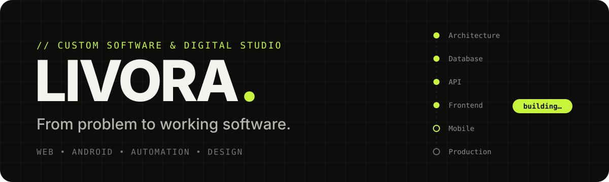

<p align="center">
  
</p>

<p align="center">
  
  
  
  
</p>

<p align="center">
  <b>The website for LIVORA</b>, a studio that builds custom web apps, Android apps,<br/>
  internal business software and digital brand experiences.
</p>

---

## ✦ The idea

Most businesses run on a patchwork of spreadsheets, WhatsApp threads and tools that almost fit.
LIVORA builds the software that actually fits — and this site is meant to *show* that, not just say it.

The hero doesn't sit still: a mock business system **builds itself in front of you**, stage by stage —
architecture → database → API → frontend → dashboard → mobile → cloud → production — then loops.
Every section after that follows the same rule: **motion that explains something.**

## ✦ What's inside

| Section | What it does |
|---|---|
| **Hero** | A live "system assembling itself" dashboard with customers, branches, approvals and reports |
| **Orbit & Connected Systems** | How scattered tools collapse into one integrated LIVORA system |
| **Automation** | A live feed of the system reacting to events: low stock → draft PO → approval → supplier → monthly report |
| **Services** | Web, Android, internal apps, marketing, social, ATS resumes, brand design, academic projects |
| **Before / After** | A side-by-side comparison of the old way vs. the custom-built way |
| **Process** | From the first conversation to production, step by step |
| **Try Before You Commit** | Free strategy session and interactive prototypes |
| **Portfolio · Technology · Team** | The work, the stack and the people behind it |
| **About pages** | Purpose, motivation, mission & vision, philosophy and quality |
| **Contact** | Form, plus a floating WhatsApp button for instant chat |

## ✦ Design language

<table>
  <tr>
    <td align="center"><br/><b>Ink</b><br/><code>#0D0D0C</code></td>
    <td align="center"><br/><b>Paper</b><br/><code>#F4F4EF</code></td>
    <td align="center"><br/><b>Lime</b><br/><code>#C8F53B</code></td>
    <td align="center"><br/><b>Lime Deep</b><br/><code>#557200</code></td>
  </tr>
</table>

- **Type:** Bricolage Grotesque for headlines, Inter for body, JetBrains Mono for system labels, Caveat for handwritten notes
- **Surfaces:** soft shadows and distinct section backgrounds instead of hairline borders
- **Motion:** Framer Motion reveals, a custom cursor and a skeleton loader on first paint

## ✦ For authorized collaborators

> [!IMPORTANT]
> This is a private, proprietary project. Only collaborators with written permission from the owner may clone, run or modify it. See [LICENSE](LICENSE).

```bash
npm install
npm run dev        # http://localhost:5173
```

| Command | Purpose |
|---|---|
| `npm run dev` | Start the Vite dev server with hot reload |
| `npm run build` | Build for production into `dist/` |
| `npm run preview` | Preview the production build locally |

## ✦ Project structure

```
LIVORA/
├── public/              favicon, robots.txt, sitemap.xml, media
├── src/
│   ├── App.jsx          page composition + lightweight path-based routing
│   ├── main.jsx         entry point
│   ├── index.css        design tokens (ink / paper / lime) and globals
│   ├── hooks/           shared animation helpers
│   ├── assets/          portfolio artwork (SVG)
│   └── components/      one .jsx + .css pair per section
├── index.html           SEO + Open Graph meta, font loading
└── vite.config.js
```

## ✦ License

**Proprietary — All Rights Reserved** © 2026 Prajwal Nair.

This code, design and content may **not** be copied, used, modified, deployed or redistributed by anyone
except authorized collaborators with written permission. Being able to see this repository does not give you
any right to use it. Full terms are in [LICENSE](LICENSE).

<p align="center">
  <sub>Built with care, a lot of motion, and one very specific shade of lime.</sub>
</p>
